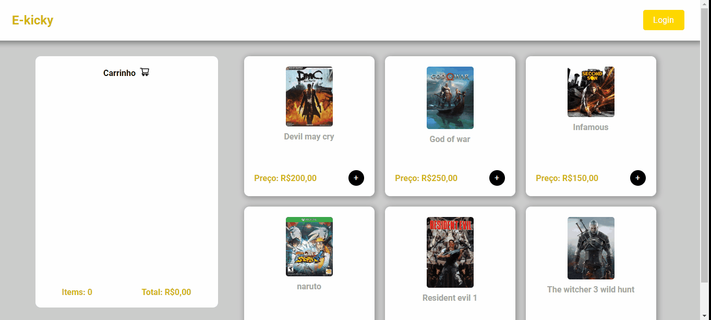
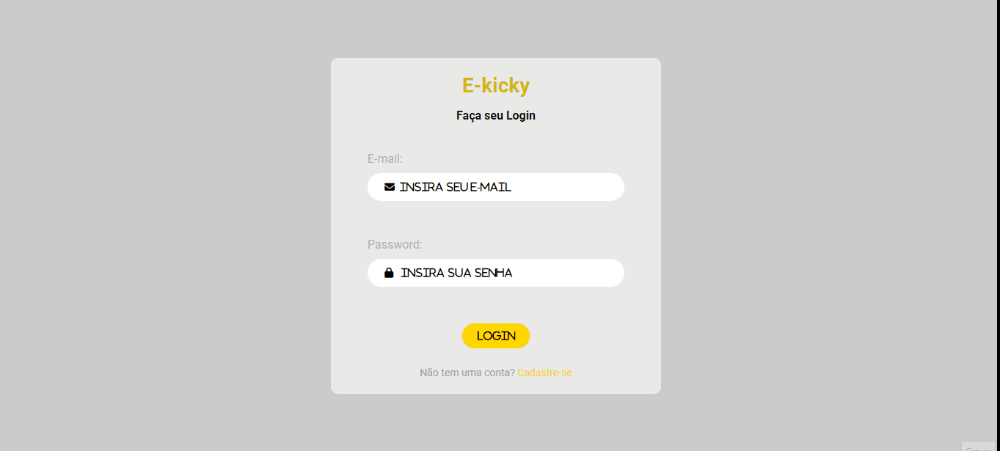
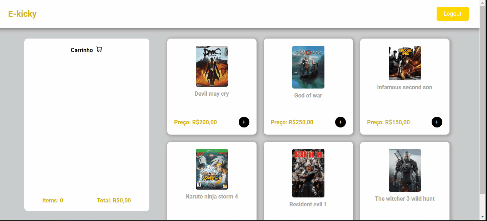

<h1 align="center">E-kicky</h1>
<p align="center">Uma aplicação que simula uma loja virtual de games.<p>
<br>

## Features ✨

- [x] Cadastro de usuários
- [x] Login de usuários
- [x] Logout de usuários
- [x] Ler os produtos de um banco de dados
- [x] Adicionar produtos no carrinho
- [x] Apagar produtos do carrinho

---

## Demo 📷 

<h1 align="center">
    
</h1>

<h1 align="center">
    
</h1>

<h1 align="center">
    
</h1>

## Pré requisitos

- [Git](https://git-scm.com)
- [Node.js](https://nodejs.org/en/)

É bom que tenha um [Vscode](https://code.visualstudio.com/) para editar o código

---
## Rodando a aplicação

Em terminais separados você irá rodar o backend e o frontend:

```bash
   #Clone o repositório
   git clone https://github.com/Kakaziu/E-kicky

   # Backend:
   # Ir até a pasta

   cd E-kicky
   cd backend

   npm start


```

Em outro terminal

```bash
    # Frontend:

    cd E-kicky
    cd frontend

    npm start
```


---

## Tecnologias

- [Node.js](https://nodejs.org/en/)
- [React.js](https://pt-bt.reactjs.org/)
- [Javascript](https://www.javascript.com/)

---

Obrigado a todos que acompanharam até aqui 🧡 | [Linkedin](https://www.linkedin.com/in/kau%C3%A3-borba-390946235/) 
